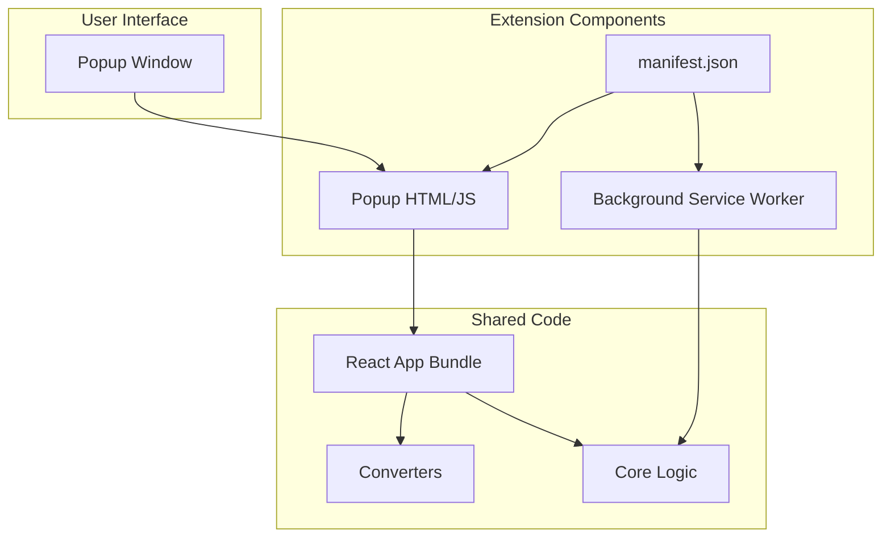

# MarkItDown Browser Extension - Architecture Plan

## Overview

Convert the existing MarkItDown Browser React web application into a Chrome/Edge browser extension with popup support. The extension will allow users to convert documents (PDF, DOCX, HTML, PPTX, XLSX, MSG) to Markdown directly from their browser.

**Note:** This plan focuses on **popup-only** implementation for v1. Sidebar support may be added in a future phase.

---

## Requirements

- **Target Browsers**: Chrome, Edge (Chromium-based)
- **Extension Type**: Popup
- **Core Functionality**:
  - Click extension icon to open popup window
  - Drag-and-drop or select files to convert
  - View Markdown preview
  - Copy to clipboard or download as .md file
- **Permissions**: File access, downloads, storage
- **Manifest Version**: V3 (current Chrome/Edge standard)

---

## Extension Architecture

### High-Level Architecture



### Extension Structure

```
markitdown-extension/
├── public/
│   ├── manifest.json          # Extension manifest
│   ├── popup.html             # Popup page
│   ├── icons/                 # Extension icons
│   │   ├── icon-16.png
│   │   ├── icon-48.png
│   │   ├── icon-128.png
│   │   └── icon-512.png
│   └── pdf.worker.mjs         # Bundled PDF.js worker
├── src/
│   ├── extension/
│   │   ├── popup.tsx          # Popup React component
│   │   ├── background.ts      # Background service worker
│   │   ├── types.ts           # Extension-specific types
│   │   └── useMarkItDown.ts   # Shared hook for conversion logic
│   ├── components/            # Existing components (reused)
│   ├── converters/            # Existing converters (reused)
│   ├── core/                  # Existing core logic (reused)
│   └── utils/                 # Existing utilities (reused)
├── vite.config.extension.ts   # Vite config for extension build
├── package.json
└── tsconfig.json
```

---

## Implementation Plan

### Phase 1: Extension Manifest & Configuration

1. **Create `public/manifest.json`**
   ```json
   {
     "manifest_version": 3,
     "name": "MarkItDown Browser",
     "version": "0.1.0",
     "description": "Convert documents (PDF, DOCX, HTML, PPTX, XLSX, MSG) to Markdown directly in your browser",
     "action": {
       "default_popup": "popup.html",
       "default_icon": {
         "16": "icons/icon-16.png",
         "48": "icons/icon-48.png",
         "128": "icons/icon-128.png",
         "512": "icons/icon-512.png"
       },
       "default_title": "MarkItDown Browser"
     },
     "icons": {
       "16": "icons/icon-16.png",
       "48": "icons/icon-48.png",
       "128": "icons/icon-128.png",
       "512": "icons/icon-512.png"
     },
     "permissions": [
       "storage",
       "downloads"
     ],
     "content_security_policy": {
       "extension_pages": "script-src 'self'; worker-src 'self' blob:"
     },
     "web_accessible_resources": [
       {
         "resources": ["pdf.worker.mjs"],
         "matches": ["<all_urls>"]
       }
     ],
     "background": {
       "service_worker": "background.js",
       "type": "module"
     }
   }
   ```

2. **Create Extension Icons**
   - Generate placeholder icons at 16x16, 48x48, 128x128, 512x512 pixels
   - Use simple gradient background with "MD" text
   - Store in `public/icons/`

### Phase 2: Build Configuration

3. **Create `vite.config.extension.ts`**
   - Configure Vite for extension build with popup entry point
   - Set up PDF.js worker copying to public directory
   - Configure output directory structure (`dist/`)
   - Handle Node.js polyfills for browser compatibility

4. **Update `package.json` Scripts**
   ```json
   {
     "scripts": {
       "dev": "vite",
       "build": "tsc -b && vite build",
       "preview": "vite preview",
       "build:extension": "tsc -b && vite build --config vite.config.extension.ts",
       "dev:extension": "vite --config vite.config.extension.ts --mode development",
       "package:extension": "npm run build:extension && cd dist && zip -r ../markitdown-extension.zip ."
     }
   }
   ```

### Phase 3: PDF.js Worker Setup

5. **Configure PDF.js Worker for Extension**
   - Copy PDF.js worker to `public/pdf.worker.mjs` during build
   - Update converter to use `chrome.runtime.getURL()` for worker path
   - Ensure worker is listed in `web_accessible_resources`

### Phase 4: Code Refactoring & Shared Logic

6. **Create `src/extension/useMarkItDown.ts`**
   - Extract core conversion logic from `App.tsx` into a reusable custom hook
   - Include file handling, conversion orchestration, and state management
   - Keep UI-specific logic (popovers, layout) in components

7. **Create `src/extension/popup.tsx`**
   - Adapt existing `App.tsx` for popup context
   - Adjust layout for popup dimensions (400x600px recommended)
   - Maintain drag-and-drop functionality
   - Simplify header/footer for constrained space
   - Use `useMarkItDown` hook for core logic

8. **Create `src/extension/background.ts`**
   - Handle extension installation (optional welcome message)
   - Set up basic service worker lifecycle management
   - Prepare for future features (settings sync, etc.)

9. **Create `public/popup.html`**
   - HTML entry point for popup
   - Load React bundle
   - Set up root div for React mounting
   - Include meta viewport for proper scaling

### Phase 5: Component Adaptations

10. **Update `ActionButtons.tsx` for Extension Context**
    - Replace `<a download>` with `chrome.downloads.download()` API
    - Handle clipboard copy with extension-compatible method
    - Add error handling for permission issues

11. **Update `FileUpload.tsx` for Popup Dimensions**
    - Ensure drag-and-drop works in constrained space
    - Test file input dialog behavior
    - Adjust styling for popup width

12. **Update `MarkdownPreview.tsx` for Popup**
    - Ensure proper scrolling for long content
    - Test performance with large markdown files
    - Adjust font sizes for popup readability

### Phase 6: File Handling & Permissions

13. **Implement File Input Handling**
    - Ensure `<input type="file">` works in extension context
    - Handle drag-and-drop events properly
    - Test with all supported file types

14. **Configure Content Security Policy**
    - Verify no inline scripts violate CSP
    - Move any inline styles to CSS files
    - Test worker-src configuration for PDF.js

### Phase 7: Testing & Debugging

15. **Local Development Setup**
    - Set up Chrome extension loading for development
    - Configure manual reload workflow (or use CRXJS for HMR)
    - Test popup functionality

16. **Comprehensive Testing**
    - Test all file formats: PDF, DOCX, HTML, PPTX, XLSX, MSG
    - Test drag-and-drop in popup
    - Test file picker in popup
    - Test copy to clipboard
    - Test download functionality (chrome.downloads API)
    - Test dark mode
    - Test error handling
    - Test with large files (memory limits)
    - Check browser console for CSP violations

17. **Cross-Browser Testing**
    - Test in Chrome (latest)
    - Test in Edge (latest)
    - Verify consistent behavior

### Phase 8: Documentation & Packaging

18. **Update README**
    - Add extension installation instructions
    - Document development workflow
    - Add troubleshooting section
    - Include supported file formats

19. **Package Extension**
    - Create zip package for distribution
    - Prepare for Chrome Web Store submission
    - Prepare for Edge Add-ons submission

---

## Technical Considerations

### Manifest V3 Requirements

- **Service Workers**: Background scripts use service workers instead of persistent background pages
- **Content Security Policy**: Stricter CSP rules, no inline scripts
- **Permissions**: More granular permission model

### Extension-Specific Challenges

1. **File Access**
   - Extensions have limited file system access
   - Files must be selected via user action (input or drag-drop)
   - Cannot access arbitrary files on disk

2. **Popup Dimensions**
   - Recommended: 400x600px maximum
   - Content must be scrollable if it exceeds dimensions
   - Design must work in constrained space

3. **PDF.js Worker Bundling**
   - Worker must be accessible via `chrome.runtime.getURL()`
   - Must be listed in `web_accessible_resources`
   - CSP must allow `worker-src 'self' blob:`

4. **Downloads API**
   - Use `chrome.downloads.download()` instead of `<a download>`
   - Requires `"downloads"` permission
   - Can set `saveAs: true` to show save dialog

5. **Content Security Policy**
   - No inline scripts allowed
   - All styles must be in external CSS or inline via style tags (allowed in extension_pages)
   - Worker-src must be properly configured

### Build Configuration

```typescript
// vite.config.extension.ts
import { defineConfig } from 'vite'
import react from '@vitejs/plugin-react'
import { nodePolyfills } from 'vite-plugin-node-polyfills'
import { resolve } from 'path'
import { copyFileSync, mkdirSync } from 'fs'

// Plugin to copy PDF.js worker
function copyPdfWorker() {
  return {
    name: 'copy-pdf-worker',
    writeBundle() {
      mkdirSync('dist', { recursive: true })
      copyFileSync(
        'node_modules/pdfjs-dist/build/pdf.worker.mjs',
        'dist/pdf.worker.mjs'
      )
    },
  }
}

export default defineConfig({
  plugins: [
    react(),
    nodePolyfills({
      include: ['buffer', 'stream', 'util', 'process', 'events', 'path'],
      globals: {
        Buffer: true,
        global: true,
        process: true,
      },
    }),
    copyPdfWorker(),
  ],
  build: {
    outDir: 'dist',
    rollupOptions: {
      input: {
        popup: resolve(__dirname, 'public/popup.html'),
        background: resolve(__dirname, 'src/extension/background.ts'),
      },
      output: {
        entryFileNames: '[name].js',
        chunkFileNames: 'chunks/[name].js',
        assetFileNames: 'assets/[name].[ext]',
      },
    },
  },
})
```

### Shared Hook Structure

```typescript
// src/extension/useMarkItDown.ts
import { useState } from 'react'
import { MarkItDown } from '../core/MarkItDown'
import type { DocumentConverterResult } from '../core/types'

interface FileResult {
  file: File
  result: DocumentConverterResult | null
  error: string | null
  loading: boolean
}

export function useMarkItDown() {
  const [files, setFiles] = useState<FileResult[]>([])
  const [selectedFileIndex, setSelectedFileIndex] = useState<number | null>(null)
  const [converter] = useState(() => new MarkItDown())

  const handleFilesSelected = async (selectedFiles: File[]) => {
    // ... conversion logic from App.tsx
  }

  const handleRemoveFile = (index: number) => {
    // ... removal logic
  }

  return {
    files,
    selectedFileIndex,
    setSelectedFileIndex,
    handleFilesSelected,
    handleRemoveFile,
  }
}
```

### Popup Component Structure

```typescript
// src/extension/popup.tsx
import { useMarkItDown } from './useMarkItDown'
import { FileUpload } from '../components/FileUpload'
import { FileList } from '../components/FileList'
import { MarkdownPreview } from '../components/MarkdownPreview'
import { ActionButtons } from '../components/ActionButtons'

export function Popup() {
  const {
    files,
    selectedFileIndex,
    setSelectedFileIndex,
    handleFilesSelected,
    handleRemoveFile,
  } = useMarkItDown()

  // Simplified popup UI (400x600px)
  return (
    <div className="w-[400px] min-h-[500px] max-h-[600px] p-4">
      {/* Header, content, footer */}
    </div>
  )
}
```

---

## Dependencies

### New Development Dependencies

None required - using standard Vite configuration

### Existing Dependencies (No Changes Needed)

All existing dependencies remain the same:
- React 18, TypeScript, Vite
- Conversion libraries (pdfjs-dist, mammoth, marked, xlsx, jszip, @kenjiuno/msgreader)
- UI libraries (lucide-react, tailwind-merge, clsx, etc.)

---

## File Changes Summary

### New Files to Create

1. `public/manifest.json` - Extension manifest
2. `public/popup.html` - Popup entry point
3. `public/icons/icon-16.png` - Extension icon (16x16)
4. `public/icons/icon-48.png` - Extension icon (48x48)
5. `public/icons/icon-128.png` - Extension icon (128x128)
6. `public/icons/icon-512.png` - Extension icon (512x512)
7. `src/extension/popup.tsx` - Popup React component
8. `src/extension/background.ts` - Background service worker
9. `src/extension/types.ts` - Extension-specific types (if needed)
10. `src/extension/useMarkItDown.ts` - Shared conversion hook
11. `vite.config.extension.ts` - Extension build configuration

### Files to Modify

1. `package.json` - Add extension build scripts
2. `src/components/ActionButtons.tsx` - Use chrome.downloads API
3. `src/converters/PdfConverter.ts` - Update worker path for extension
4. `README.md` - Add extension documentation

### Files to Keep Unchanged

- `src/core/*` - Core logic unchanged
- `src/utils/*` - Utilities unchanged
- `src/components/FileUpload.tsx` - May need minor styling
- `src/components/FileList.tsx` - May need minor styling
- `src/components/MarkdownPreview.tsx` - May need minor styling

---

## Development Workflow

### Local Development

```bash
# Build extension
npm run build:extension

# Load extension in Chrome/Edge
1. Open chrome://extensions/ (or edge://extensions/)
2. Enable "Developer mode"
3. Click "Load unpacked"
4. Select the dist/ directory

# For development iterations
npm run build:extension
# Then click "Refresh" button in chrome://extensions/
```

### Building for Distribution

```bash
# Production build and package
npm run package:extension
# Generates markitdown-extension.zip
```

---

## Chrome Web Store Submission Checklist

- [ ] Extension name and description
- [ ] Screenshots (1280x800 or 640x400) - capture popup UI
- [ ] Promotional tile (440x280)
- [ ] Marquee tile (1280x600)
- [ ] Privacy policy (can use GitHub page or simple hosted page)
- [ ] Detailed description of features
- [ ] Category selection (Productivity)
- [ ] Language support (English)
- [ ] Publisher information
- [ ] Review all permissions and justify each one

### Permission Justifications

| Permission | Justification |
|------------|---------------|
| `storage` | Store user preferences (dark mode, etc.) |
| `downloads` | Allow users to download converted .md files |

---

## Edge Add-ons Submission Checklist

- [ ] Package as .zip
- [ ] Submit to Microsoft Edge Add-ons store
- [ ] Provide same assets as Chrome submission
- [ ] Complete publisher verification

---

## Risk Assessment & Mitigation

| Risk | Impact | Mitigation |
|------|--------|------------|
| PDF.js worker loading issues | High | Copy worker to dist/, use chrome.runtime.getURL(), list in web_accessible_resources |
| Popup size constraints | Medium | Implement responsive design, scrollable content, test at 400x600px |
| CSP violations | High | No inline scripts, external CSS only, proper worker-src |
| chrome.downloads API issues | Medium | Handle permissions gracefully, provide fallback copy option |
| Memory limits with large files | Medium | Implement loading states, add file size warnings, test limits |
| Extension API compatibility | Low | Test on both Chrome and Edge, both use Manifest V3 |

---

## Success Criteria

- [ ] Extension loads successfully in Chrome
- [ ] Extension loads successfully in Edge
- [ ] Popup opens and displays UI correctly (400x600px)
- [ ] Drag-and-drop works in popup
- [ ] File picker works in popup
- [ ] All file formats convert successfully (PDF, DOCX, HTML, PPTX, XLSX, MSG)
- [ ] Copy to clipboard works
- [ ] Download as .md works (via chrome.downloads API)
- [ ] Dark mode works
- [ ] No CSP violations in console
- [ ] Extension passes Chrome Web Store validation
- [ ] Extension passes Edge Add-ons validation
- [ ] Documentation is complete

---

## Future Enhancements (Post-v1)

- [ ] Sidebar support (sidePanel API)
- [ ] Settings page for user preferences
- [ ] Sync settings across devices (chrome.storage.sync)
- [ ] Context menu integration (right-click to convert)
- [ ] Batch conversion support
- [ ] Custom markdown formatting options
- [ ] Conversion history
- [ ] Keyboard shortcuts

---

## Timeline Estimate

| Phase | Estimated Time |
|-------|----------------|
| Phase 1: Manifest & Config | 1-2 hours |
| Phase 2: Build Configuration | 1-2 hours |
| Phase 3: PDF.js Worker Setup | 1 hour |
| Phase 4: Code Refactoring | 2-3 hours |
| Phase 5: Component Adaptations | 2-3 hours |
| Phase 6: File Handling | 1 hour |
| Phase 7: Testing | 3-4 hours |
| Phase 8: Documentation & Packaging | 1-2 hours |
| **Total** | **12-18 hours** |

---

## Notes

- **Icons**: Use simple placeholder icons with "MD" text and gradient background for v1
- **Popup Size**: Start with 400x600px, adjust based on testing
- **Testing**: Manual testing only for v1, automated tests can be added later
- **Privacy**: Emphasize "fully client-side" in store descriptions - no data leaves the browser
